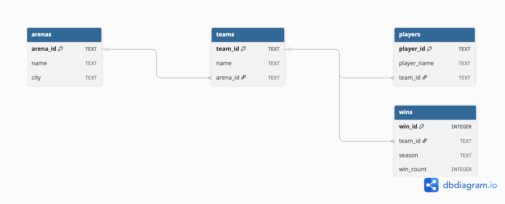

# College Basketball

My project models data for college basketball teams. Includes team information, player rosters, arenas, and win records for the 2025-2026 season.



## Query I Thought It Did Well On

**Question**: What are the names of all players on the BYU Cougars?

**GPT SQL Response**:

```
SELECT players.player_name
FROM players
JOIN teams ON players.team_id = teams.team_id
WHERE teams.name = 'BYU Cougars';

```

**Friendly Response**: Sure! The BYU Cougars players are Jaxson Robinson, Dallin Hall, Trevin Knell, Fousseyni Traore, and Aly Khalifa.

## Question That It Tripped Up On

**Question**: Who is the fan favorite?

**GPT SQL Response**:

```
SELECT players.player_name, COUNT(wins.win_id) AS win_count
FROM players
JOIN wins ON players.team_id = wins.team_id
GROUP BY players.player_id
ORDER BY win_count DESC
LIMIT 1;
```

**SQL Result**: `[('Jaxson Robinson', 1)]`

**Friendly Response**: Jaxson Robinson is the fan favorite.

This one is an interesting one because it had no context for if we meant team or player when it came to fan favorite. So what it did is it chose a random player from the winning team, which is clever but not really what the user probably intended.

## Multi-Shot Attempt

I provided an example of a successful query and asked the same question again with few-shot prompting.

**Question (multi-shot)**: What are the names of all players on the BYU Cougars?

**SQL Result**:

```
SELECT p.player_name
FROM players p
JOIN teams t ON p.team_id = t.team_id
WHERE t.name = 'BYU Cougars';
```

**Friendly Response**: Jaxson Robinson, Dallin Hall, Trevin Knell, Fousseyni Traore, Aly Khalifa.

**Question (multi-shot)**: Who is the fan favorite?

**SQL Result**:

```
SELECT t.name, SUM(w.win_count) AS total_wins
FROM teams t
LEFT JOIN wins w ON t.team_id = w.team_id
GROUP BY t.team_id
ORDER BY total_wins DESC;
```

**Friendly Response**: The fan favorite is the Purdue Boilermakers.

It was interesting this time that when it had some more context given, it chose a team instead of a player. The context given was the table of the teams and their wins so that makes more sense

## Conclusion

For college basketball data queries, GPT-4 does very well at generating SQL for simple to moderately complex joins. The key finding is that result interpretation and friendly response generation improves significantly with few-shot examples.

Main strengths:

- Simple SELECT queries work reliably
- JOINs across multiple tables are handled well
- WHERE clauses and filtering work correctly

Main weaknesses:

- Without examples, friendly responses can be generic or incomplete
- Result interpretation requires better context
- Zero-shot prompting often misses relevant context

**Prompting strategies tested**: Zero-shot, Few-shot/Multi-shot
**Best approach found**: Few-shot examples improve both SQL quality and result interpretation
